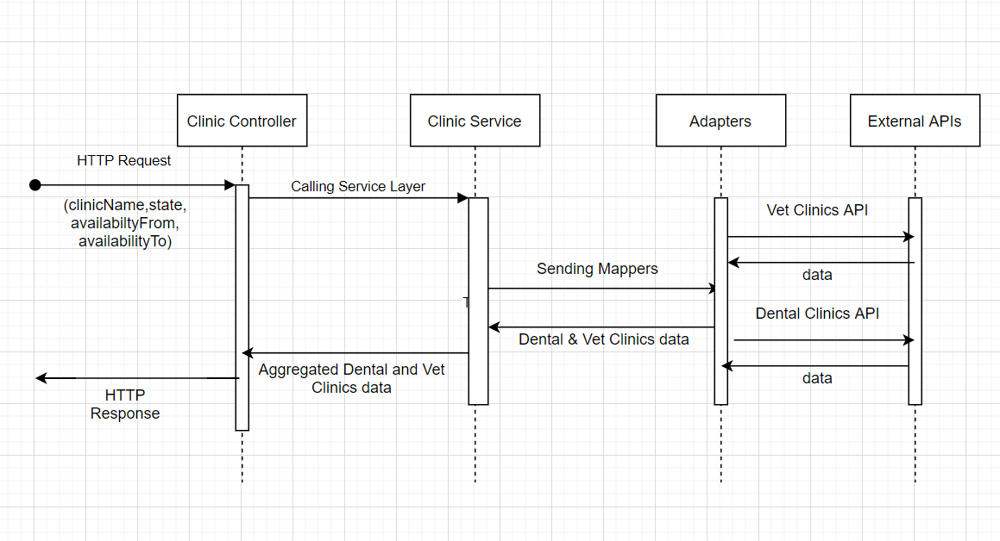

# Clinic Search API

## Setup Without Docker
- Download & Install node.js 
- Pull the repo and cd to the clinics directory.
- Run `npm install` command
- node ./app.js

## Setup With Docker

- Pull the repo and cd to the directory.
- Run `sudo docker build -t clinics-search-image .`
- Run `sudo docker run -it -p 8080:8080 --name clinics clinics-search-image`

## API diagram

## Architecture
- `app.js` is responsible for initiating the web server and setting the system variables and values and
setting up the Application Cache.
- `.env` file contains all configured values like the PORT Number, web services URLs and TTL values of each value stored in Cache like the response of the web service we stroing it in cache after the first trigger, to make the system more faster after the first web service call, also we made the TTL of each web service response to be 1 day cause the response maybe changed from the service provider side.
Note: the value of TTL maybe changed based on the agreement with service provider team and how frequently the service response is changing.
- `Controller Layer` is responsible for defining the routes of the API and the HTTP methods and the final response of the API here we have only route with HTTP GET method to provide the clinics data.
- `Service Layer` is responsible for receiving the requests from the `Controller Layer` and handling the business logic of the API and perform any type of checks and validations on the search values of the clinics then interacting to the edge layers like the `Model Layer` or `Adapters Layer`.
- `Model Layer` is responsible for providing the clinics data which requested by the `Service Layer` 
- `Mappers Layer` is responsible to provide mappers objects of Vet and Dental Clinics to allow the other layers to communicate with each others with the data they need only not the whole Clinic data.
- `Adapters Layer` is responsible to get the clinics search options and connecting to the VET or Dental Web Services to get the response and transform it to the suitable format to be used by the `Service Layer`. 

## API documenation
 - https://app.swaggerhub.com/apis/mohamedaligaber/Clinics-API/1.0.0#/Clinics
 - http://localhost:8080/v1/clinics will return all the available Clinics.

 - Only `clinicName`, `state`, `availabilityFrom`, and `availabilityTo` options are valid to be provided in the URL query if anything else is provided the API will ignore it.
 - Filter by `clinicName` http://localhost:8080/v1/clinics?clinicName=Good%20Health%20Home will return `Good Health Home` Clinic also the lower and upper cases are handled, also if you write just a part of the clinic name like `Good Health` the clinics with name `Good Health Home` will be returned there is no need to write the full clinic name.
 - Filter by `state` http://localhost:8080/v1/clinics?city=Alaska will return any clinic with state name `Alaska` or code `AL` also the lower and upper cases are handled.
 - Filter by `availabilityFrom` or `availabilityTo` http://localhost:8080/v1/clinics?availabilityFrom=09:00 will return any clinic with opening From or To the entered values.
 - Also we can combine any number of search options with each other or not using search options at all to return the whole result.
 

## UnitTest  - without docker - (Open New Terminal)
 - termiante the Application execution, Run `Ctrl + C`
 - Run `npm test` to run all the unittests.

## UnitTest  - docker - (Open New Terminal)
 - Run `sudo docker exec clinics npm test` to get the UnitTest & IntegrationTest coverage(some times the first test case failing because of the 'listen EADDRINUSE: address already in use 0.0.0.0:8080' Error, 
 this issue solved in the test environments normally)
